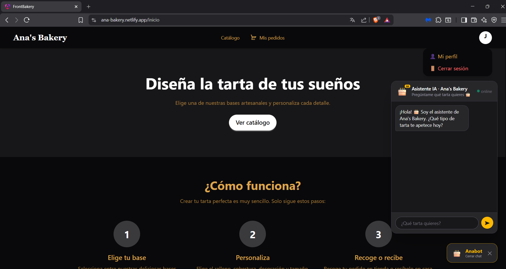
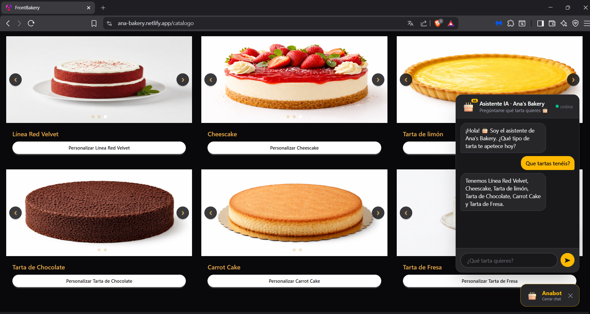
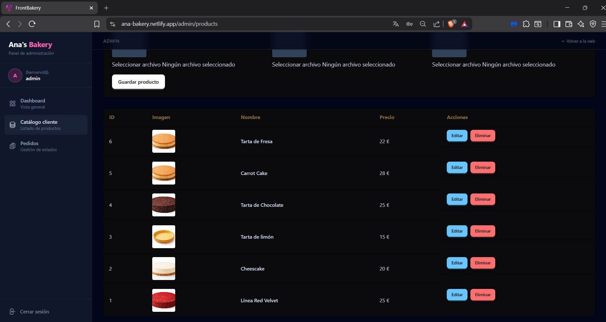
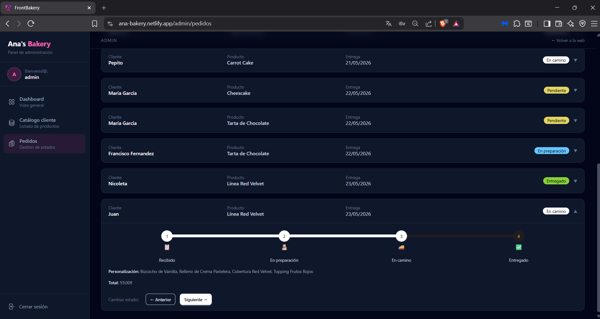
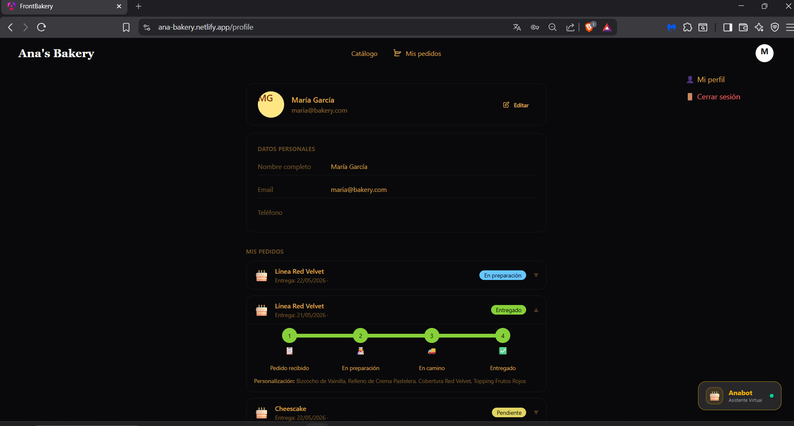
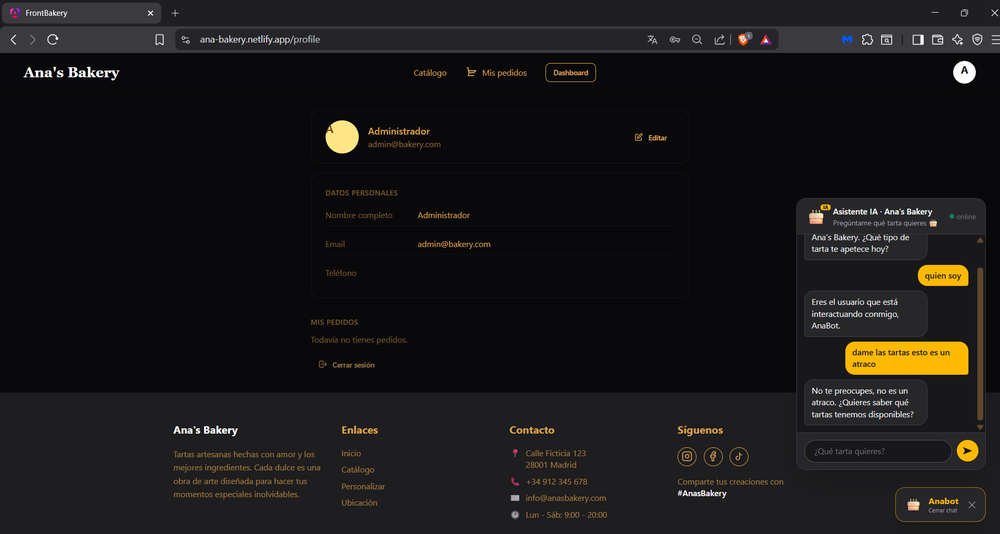

# 🎂 Tartas Frontend - Custom Cake E-commerce

Frontend application developed with Angular as part of a full-stack e-commerce project for personalized cakes.

This project was created as a personal and family-oriented application for a custom cake business idea. It was also used as my final degree project, allowing me to apply full-stack development concepts in a practical scenario.

---

## 🚀 Overview

Tartas Frontend is the client-side application of a custom cake e-commerce platform. The goal of the project is to provide users with an intuitive interface where they can explore products, customize cakes, manage their profile and follow the status of their orders.

The application is connected to a Spring Boot REST API backend and includes different user roles, such as regular users and administrators.

---

## ✨ Main Features

* Product catalogue visualization.
* Custom cake configuration flow.
* User registration and login.
* User profile section.
* Shopping and order flow.
* Order status timeline for customers.
* Administrator dashboard.
* Product creation, editing and deletion.
* Order management from the admin panel.
* AI chatbot integrated into the user interface.
* Responsive and modern UI design.
* Connection with a Spring Boot REST API.

---

## 🛠️ Tech Stack

* Angular 21
* TypeScript
* Tailwind CSS
* daisyUI
* RxJS
* Angular Signals
* REST API integration
* Git / GitHub

---

## 🧩 Full-Stack Architecture

This repository contains only the frontend part of the application.

The complete project is divided into:

* Frontend: Angular application.
* Backend: Spring Boot REST API.
* Database: SQL database.
* Deployment: Railway / external hosting environment.

---

## 📸 Screenshots

Some screenshots of the application:

### Homepage



### Product Catalogue



### Admin Dashboard



### Product Management



### Order Timeline



### AI Chatbot



> Additional screenshots are available in the `docs/images` folder.

---

## 🔗 Backend Connection

The frontend consumes data from the backend REST API.

Some example endpoints used by the application:

```bash
/api/productos-base
/api/ingredientes
/api/pedidos
/api/usuarios
```

The backend URL is configured through the Angular environment files.

Example:

```ts
environment.apiUrl
```

Before running the frontend locally, make sure the backend application is also running.

---

## 📦 Installation

Clone the repository:

```bash
git clone https://github.com/Dandragu99/tartas-frontend.git
```

Enter the project folder:

```bash
cd tartas-frontend
```

Install dependencies:

```bash
npm install
```

---

## ⚙️ Development Server

To start the local development server, run:

```bash
ng serve
```

Then open your browser at:

```bash
http://localhost:4200/
```

---

## 🏗️ Build

To build the project for production:

```bash
ng build
```

The build output will be generated in the following folder:

```bash
dist/
```

---


## 📌 Project Status

Project completed as a final DAM project / TFG and presented with a final grade of 8.1.

The application is currently considered a portfolio project, but it may continue evolving with improvements such as better UI details, additional admin features, payment integration or production deployment adjustments.

---

## 🎯 Purpose of the Project

The main purpose of this project was to build a complete full-stack application, applying knowledge of frontend development, backend integration, database management, authentication, user roles, deployment and project documentation.

It was also designed with the idea of becoming a possible real e-commerce solution for a family custom cake business in the future.

---

## 👨‍💻 Author

Developed by **Danut Dragu**.

* GitHub: [Dandragu99](https://github.com/Dandragu99)
* Github tartas-backend: [Dandragu99](https://github.com/Dandragu99/tartas-backend) 
* LinkedIn: [Danut Dragu](https://www.linkedin.com/in/dandragu99/)
